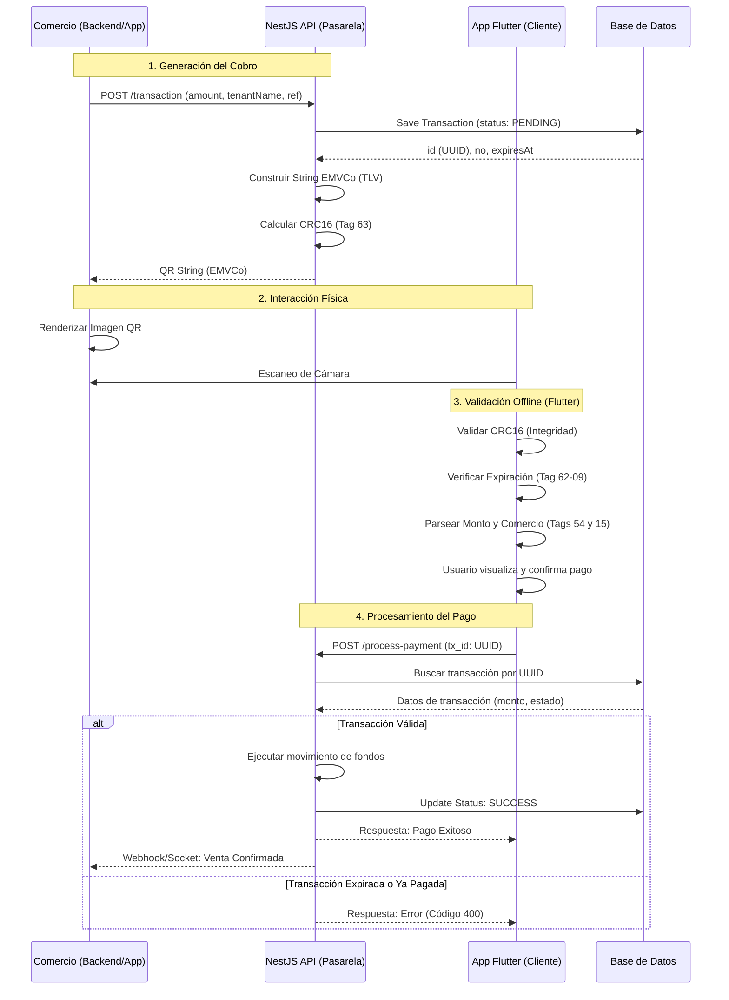

# Especificación Técnica: Pasarela de Pagos mediante EMVCo QR

## 1. Introducción

El objetivo es implementar un sistema de cobro donde el comercio genera un código QR dinámico (único por transacción) y el usuario final lo escanea mediante una App móvil para autorizar el pago. Se utiliza el estándar **EMVCo** para garantizar la interoperabilidad, integridad de los datos y eficiencia en la lectura.

## 2. Arquitectura de Datos (EMVCo TLV)

A diferencia de JSON, EMVCo utiliza una estructura **TLV (Tag-Length-Value)**.

* **Tag:** 2 dígitos que identifican el campo.
* **Length:** 2 dígitos que indican la longitud del valor.
* **Value:** El contenido del dato.

### Mapa de Tags Utilizados

| Tag | Descripción | Valor / Origen |
| | | |
| **00** | Payload Format Indicator | Fijo: `01` |
| **01** | Point of Initiation Method | Fijo: `12` (QR Dinámico) |
| **15** | Merchant Name | `tenantName` (máx. 25 chars) |
| **52** | Merchant Category Code | `5311` (Comercio Online General) |
| **53** | Transaction Currency | `840` (USD) o `170` (COP) |
| **54** | Transaction Amount | Monto de la transacción (ej. `1500`) |
| **62** | Additional Data Context | Contenedor de Sub-tags (ver abajo) |
| **63** | CRC16 CCITT | Checksum de validación (4 chars hex) |

### Sub-tags del Campo 62 (Datos de Negocio)

Para incluir la lógica de nuestra pasarela, extendemos el Tag 62 con:

* **01:** Número de Referencia (`ref`).
* **05:** ID de Transacción (UUID).
* **07:** Consecutivo de la pasarela (`no`).
* **09:** Fecha de expiración (`expiresAt`).

## 3. Flujo de Proceso

### Paso 1: Generación de Intención de Cobro (Backend NestJS)

El comercio solicita un cobro. El backend genera un registro en la base de datos con estado `PENDING` y construye el string EMVCo.

**Lógica del Servicio:**

1. Recolectar datos de la transacción.
2. Concatenar los Tags siguiendo el orden numérico.
3. Calcular el **CRC16-CCITT (False)** sobre el string completo.
4. Retornar el string al solicitante.

### Paso 2: Representación Visual (App Comercio)

La App del comercio recibe el string y lo convierte en un código QR.

* **Recomendación:** Usar un nivel de corrección de errores (ECC) Nivel M o L para mantener el QR legible y no demasiado denso.

### Paso 3: Escaneo y Validación (App Flutter)

Al escanear el código, la App debe realizar las siguientes validaciones **offline**:

1. **Integridad:** Recalcular el CRC16 del string (excluyendo los últimos 4 caracteres). Si no coincide con el Tag 63, el código está alterado o mal impreso.
2. **Expiración:** Validar el Sub-tag `62-09` contra el reloj local del dispositivo.
3. **Parsing:** Extraer el monto (`54`) y el nombre del comercio (`15`) para mostrar en la UI de confirmación.

### Paso 4: Procesamiento de Pago

Si el usuario confirma, la App Flutter envía **solo el ID de transacción** (UUID) al endpoint de procesamiento mediante un canal seguro (Bearer Token).

## 4. Implementación de Referencia

### Backend (NestJS Service)

```typescript
// Requisito: npm install crc
import * as crc from 'crc';

generateEMVCoString(tx: TransactionDto): string {
    const format = (t: string, v: string) => `${t}${v.length.toString().padStart(2, '0')}${v}`;
    
    let payload = format('00', '01');
    payload += format('01', '12');
    payload += format('15', tx.tenantName.substring(0, 25));
    payload += format('52', '5311');
    payload += format('53', '840'); 
    payload += format('54', tx.amount.toString());
    
    const subTags = format('01', tx.ref) + 
                    format('05', tx.id) + 
                    format('07', tx.no.toString()) + 
                    format('09', tx.expiresAt);
    
    payload += format('62', subTags);
    payload += '6304'; // Tag de CRC

    const checksum = crc.crc16ccitt(payload).toString(16).toUpperCase().padStart(4, '0');
    return payload + checksum;
}

```

### Mobile (Flutter Parser)

```dart
Map<String, dynamic> parseEMVCo(String raw) {
  // 1. Extraer los datos ignorando el tag 63
  // 2. Iterar sobre el string con un puntero
  // 3. Si tag == '62', aplicar recursión para sub-tags
  // 4. Retornar objeto estructurado para la UI
}

```

## 5. Consideraciones de Seguridad

* **Idempotencia:** El servidor debe asegurar que un UUID de transacción no pueda ser pagado más de una vez.
* **TLS 1.3:** Toda comunicación entre las Apps y NestJS debe viajar sobre HTTPS.
* **Anti-Tampering:** Aunque el CRC16 detecta errores accidentales, para evitar ataques malintencionados se recomienda firmar el `tx_id` con un secreto compartido (HMAC) o JWT antes de colocarlo en el QR.

Aquí tienes el **Diagrama de Secuencia** detallado utilizando la sintaxis de Mermaid. Este diagrama es ideal para que los desarrolladores visualicen exactamente quién inicia cada acción y dónde ocurren las validaciones críticas.

### Diagrama de Secuencia: Flujo de Pago QR EMVCo



### Puntos clave para el equipo de desarrollo

#### Para el equipo de NestJS

1. **Tag 63 (Finalidad):** Asegúrense de que el cálculo del CRC16 sea el último paso. Si se agrega un solo espacio al final del string después de calcular el CRC, la validación en Flutter fallará.
2. **Webhook/Notificación:** El paso final es crucial. El comercio necesita saber que el pago fue exitoso sin tener que refrescar manualmente. Consideren usar **WebSockets** o **Firebase Cloud Messaging** para avisar a la App del Comercio en tiempo real.

#### Para el equipo de Flutter

1. **Manejo de Errores:** Si el CRC16 falla, no envíen la petición al servidor. Notifiquen al usuario que el código está dañado. Esto ahorra costos de infraestructura y mejora la experiencia.
2. **Seguridad Local:** No guarden el string del QR en el almacenamiento del teléfono. Procésenlo en memoria, extraigan el UUID y descarten el resto.

#### Recomendación Final de Seguridad

Para evitar que un atacante cree un QR con un UUID real pero con el nombre de su propia tienda (cambiando el Tag 15), el servidor siempre debe mostrar en la App de Flutter el nombre del comercio que **está registrado en la base de datos** para ese UUID, ignorando lo que diga el QR si hay discrepancias.
